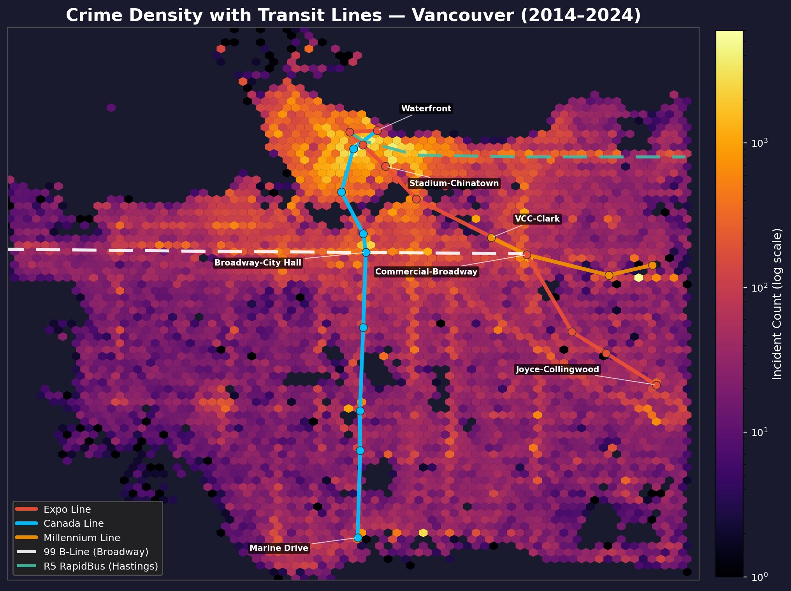
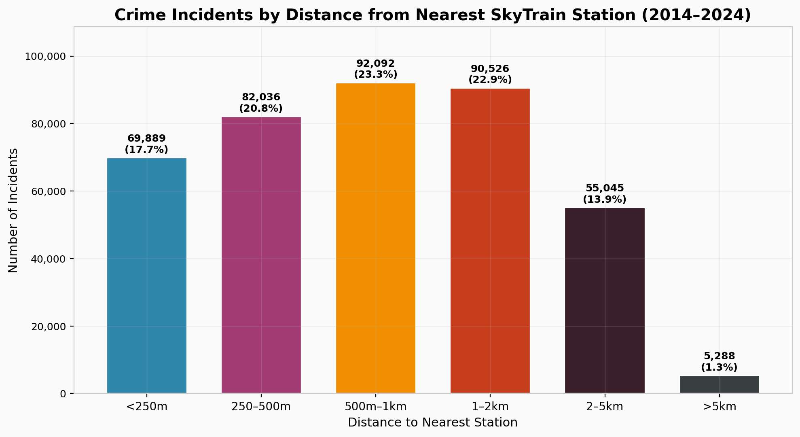
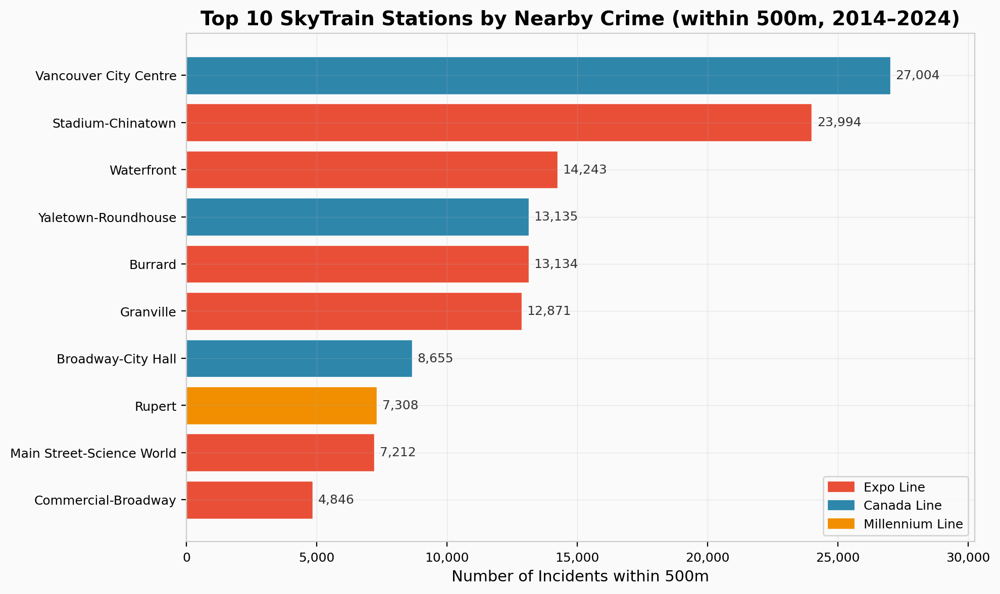
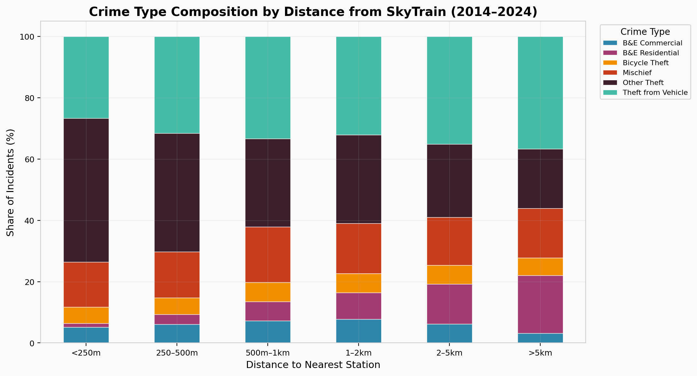
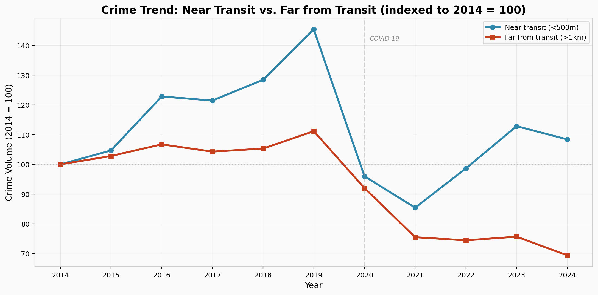
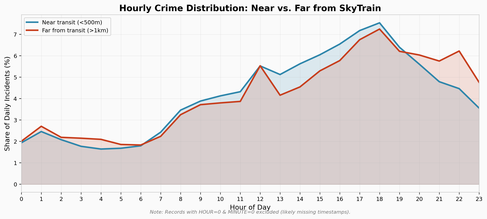

# Transit Infrastructure & Crime Proximity Analysis — Vancouver (2014–2024)

Spatial analysis of the relationship between SkyTrain stations, major bus corridors, and reported crime incidents using Vancouver Police Department open data.

## Key Finding

**38.5% of all crime in Vancouver occurs within 500m of a SkyTrain station.** Crime near transit grew +8.4% from 2014–2024, while crime far from transit (>1km) dropped –30.5% over the same period, a striking divergence that accelerated after COVID-19.



## Data

- **Source:** [Vancouver Police Department Open Data](https://geodash.vpd.ca/opendata/) — `crimedata_csv_AllNeighbourhoods_AllYears.csv`
- **Records:** 433,568 incidents (2014–2024), 394,876 with valid coordinates
- **Coverage:** 24 neighbourhoods, 11 offence categories
- **Transit data:** SkyTrain station coordinates from [TransLink GTFS](https://www.translink.ca/schedules-and-maps), line assignments and opening dates from TransLink public records

## Methods

- **Coordinate conversion:** UTM Zone 10N → WGS84 lat/lon using geodetic formulas (no external projection library)
- **Distance calculation:** Haversine formula (vectorized with NumPy) to compute great-circle distance from each incident to its nearest SkyTrain station
- **Proximity banding:** Incidents classified into distance rings (<250m, 250–500m, 500m–1km, 1–2km, 2–5km, >5km)
- **Temporal comparison:** Crime volumes indexed to 2014 = 100 for near-transit vs. far-from-transit trend analysis
- **Data quality:** 55,737 records (12.9%) with HOUR=0 and MINUTE=0 excluded from hourly analysis as likely missing timestamps

## Findings

### Proximity Distribution

| Distance from Station | Incidents | Share |
|---|---|---|
| < 250m | 69,889 | 17.7% |
| 250–500m | 82,036 | 20.8% |
| 500m–1km | 92,092 | 23.3% |
| 1–2km | 90,526 | 22.9% |
| 2–5km | 55,045 | 13.9% |
| > 5km | 5,288 | 1.3% |



### Top 5 Stations by Nearby Crime (within 500m)

| Station | Incidents |
|---|---|
| Vancouver City Centre | 27,004 |
| Stadium-Chinatown | 24,045 |
| Waterfront | 14,161 |
| Yaletown-Roundhouse | 13,135 |
| Burrard | 13,134 |



### Crime Composition Shift

Near stations (<500m), "Other Theft" accounts for 40.8% of incidents vs. 24.2% far from transit — a +16.6 percentage point difference. Residential break-ins show the opposite: 2.3% near stations vs. 9.6% far away.



### Trend Divergence (2014–2024)

Crime near transit grew +8.4% while crime far from transit dropped –30.5%. Both zones experienced the COVID-19 dip in 2020, but near-transit crime rebounded while far-from-transit crime continued declining.



### Hourly Patterns

Near-transit crime peaks sharply during business hours (11am–6pm), while far-from-transit crime stays elevated later into the evening.



## Limitations

- **Correlation, not causation:** Transit stations are located in high-density, high-foot-traffic areas. Crime concentration near stations likely reflects population density and commercial activity, not transit infrastructure directly causing crime.
- **Coordinate precision:** VPD data uses hundred-block-level geocoding, not exact addresses. Distances are approximate.
- **Missing timestamps:** 12.9% of records have HOUR=0, MINUTE=0, likely indicating missing time data rather than midnight events. These are excluded from hourly analysis but included in all other analyses.
- **Missing coordinates:** 8.9% of records lack valid coordinates and are excluded from all spatial analysis.

## Tools

Python · pandas · NumPy · matplotlib · seaborn · scikit-learn

## How to Run

```bash
# Download the VPD dataset from https://geodash.vpd.ca/opendata/
# Place CSV in the same directory as the script
python transit_crime_analysis.py
```

## Author

Kaleb Anderson 
